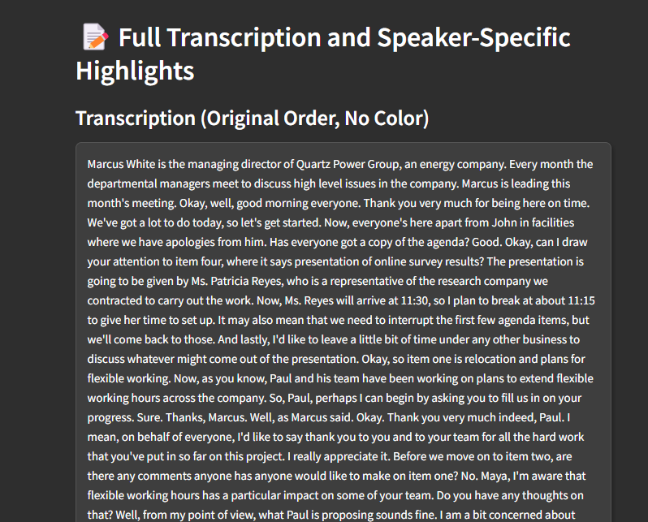
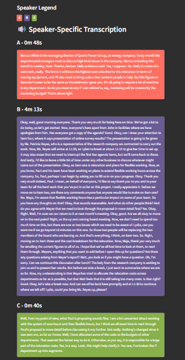
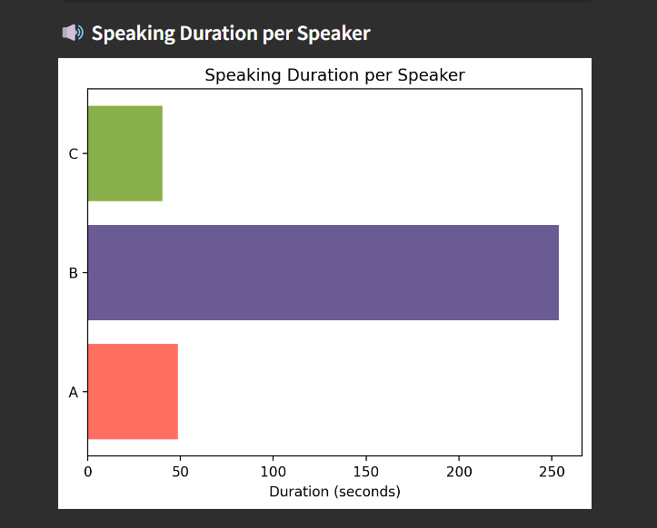
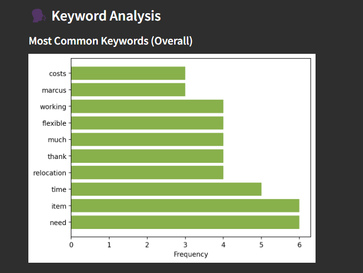
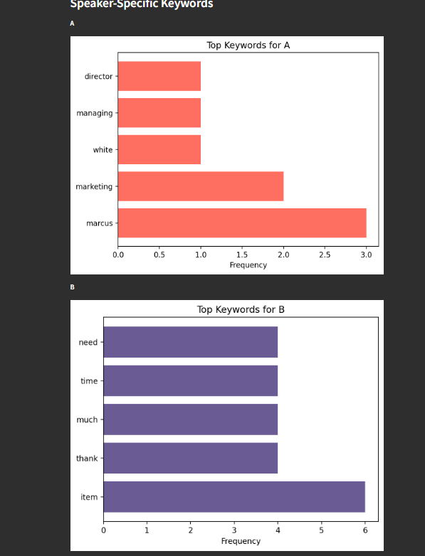
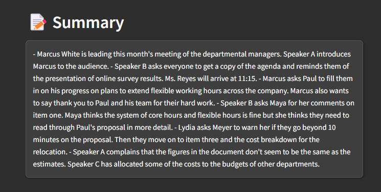
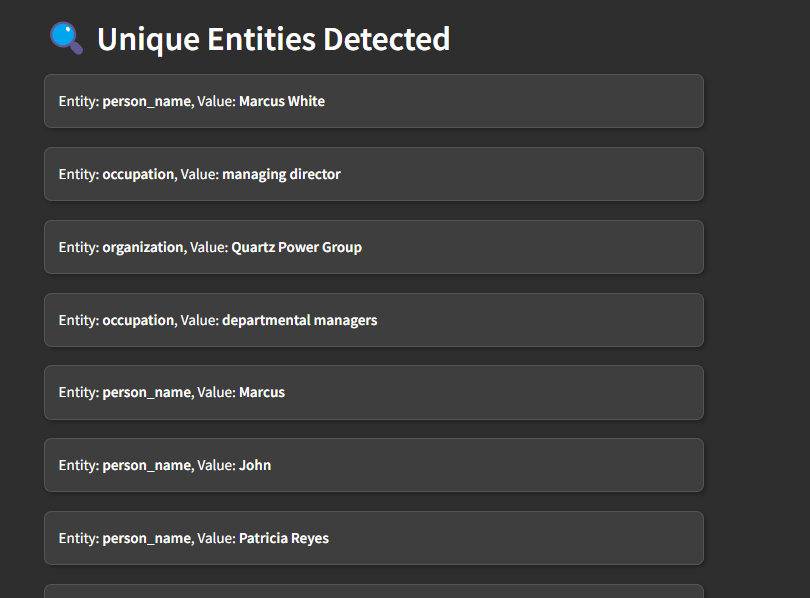
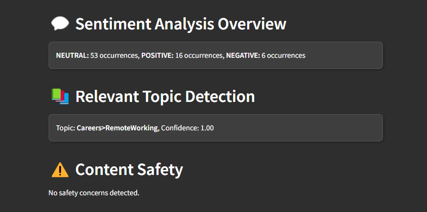

# Audio Analysis and Speaker Identification Project

This project began as a passion project over a weekend, driven by my fascination with speech diarization and audio analysis. It’s designed to capture, analyze, and visualize spoken content, making it accessible and insightful. This tool combines elements of data analysis and visualization to help make sense of audio data, from identifying speakers to extracting keywords and analyzing sentiment. And there’s so much more I plan to add as it evolves!

## ✨ App Demo

Here’s a glimpse of the app in action:

*Upload an audio file of your choice:*


*Entire transcript of the audio file, followed by speaker wise transcripts:*






*Visualization of speaking duration of all speakers:*



*Overall keyword analysis, followed by speaker wise keyword analysis:*





*Summary of the transcript:*



*List of relevant entities:*



*Sentiment analysis summary, most relevant topics, and sensitive content check:*



## ✨ Key Features

- **Transcription and Speaker Diarization**: Convert audio into text while identifying individual speakers.
- **Keyword Extraction**: Automatically highlights and visualizes significant keywords from the audio content, excluding common stop words.
- **Sentiment Analysis**: Extracts sentiment from each section of speech to provide context on tone.
- **Entity Detection**: Identifies key entities (people, places, organizations) mentioned in the audio.
- **Content Safety**: Flags sensitive content using AssemblyAI’s content safety features.
- **Speaker-Specific Analysis**: Breaks down keywords, duration, and speaking time for each speaker, using color-coded sections for clarity.

## 🛠️ Getting Started

### Prerequisites

- **Python 3.7+**: Ensure Python is installed. You can check with `python --version`.
- **AssemblyAI API Key**: Sign up at [AssemblyAI](https://www.assemblyai.com/) to get your API key. AssemblyAI offers a free usage tier with a limit of 5 hours of audio processing per month, which is perfect for testing and smaller projects.
- **Streamlit**: For the frontend, Streamlit will be used to host the app.

### Installation

1. **Clone the repository**:
   ```bash
   git clone https://github.com/your-username/audio-analysis-project.git
   cd audio-analysis-project
   ```

2. **Set up a virtual environment**:
   ```bash
   python -m venv venv
   source venv/bin/activate  # On Windows, use venv\Scripts\activate
   ```

3. **Install dependencies**:
   ```bash
   pip install -r requirements.txt
   ```

4. **Set up environment variables**:
   - In the root directory, create a `.env` file and add your API key:
     ```plaintext
     ASSEMBLYAI_API_KEY=your_assemblyai_api_key
     ```

5. **Run the application**:
   ```bash
   streamlit run app.py
   ```
   - Upload an MP3 file to start processing. The app will transcribe, analyze, and visualize the audio insights.
   - A sample meeting audio file with multiple speakers is included in the samples folder to help you quickly test out the app’s features. Just upload the sample file and see the app in action. Alternatively, feel free to download and use any other audio file of your choice.

## 📁 Directory Structure

Here’s an overview of the main directories and files in this project:

```plaintext
audio-analysis-project/
├── app.py                  # Main Streamlit application
├── src/
│   ├── assemblyai_processing.py  # Backend code for handling AssemblyAI requests
│   └── ...                # Additional modules as needed
├── data/
│   └── raw/               # Stores uploaded audio files
├── requirements.txt       # List of dependencies
└── README.md              # Project documentation
```

## 🚀 Future Work

There’s a lot more I intend to do with this project! Here a few features I plan on implementing in the near future.

- **Enhanced AssemblyAI Features**: Currently, the project uses only a subset of AssemblyAI’s capabilities. Future updates will explore and integrate more of its features, such as advanced content safety analysis, summarization, and more detailed audio insights.
- **Speaker Profile Identification**: Analyze and identify speaker profiles, such as age or gender, using additional machine learning models.
- **LangChain Integration**: Experiment with LangChain to enable complex text processing chains and knowledge retrieval from transcriptions, enhancing the app's ability to contextualize and analyze audio content.
- **Multi-API Support**: Integrate other AI providers (like OpenAI) for advanced summarization, contextual analysis, or voice-to-profile matching.
- **Real-time Processing**: Expand support for real-time audio streaming and live analysis to provide insights as audio is being recorded or played. I think AssemblyAI already has capabilities for this, but I haven't yet experimented with real-time processing.
- **Topic Modeling and Improved Visualizations**: Incorporate additional NLP techniques for enhanced topic detection and provide more user-friendly and interactive visual insights, making it easier for users to understand complex audio data at a glance.
- **More Visualizations!**: Add further visualizations for additional features I'm hoping to implement.

... and a lot more that I haven't yet noted down.

## 💡 Inspiration and Learning Goals

The initial idea for this project came up during a capstone project meeting. I wanted a way to keep track of what everyone was saying — a tool to help summarize and analyze each speaker's points without a point! I thought it would be cool if I could separate out what everyone was saying and highlight everyones key points(What I later found out was called speech diarization). The project combines skills in NLP, audio processing, and data visualization, creating a platform that could be a starting point for various use cases, such as podcast analysis, meeting summaries, and a lot more.


