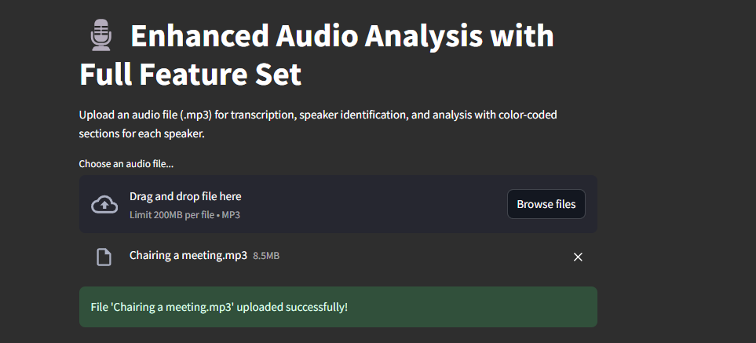

# Audio Analysis and Speaker Identification Project

This project was born out of a real need I experienced during my course curriculum's capstone project meetings. As our team discussions grew longer and more complex, I found myself wishing for a tool that could automatically track who said what and highlight the key points from each speaker. What started as a solution to my own problem - managing meeting notes and tracking speaker contributions - quickly evolved into a comprehensive audio analysis platform that could serve various business needs.

The tool combines my interests in data visualization and audio processing to create meaningful insights from spoken conversations. While it began as a solution for academic meetings, I realized its potential applications in various professional settings - from sales calls to research interviews. I'm excited to continue adding features and improving its capabilities!

## ✨ App Demo

For the sake of demonstration, I've chosen an audio clip extracted from the video of a staff meeting with multiple speakers on Youtube:

*Upload an audio file of your choice:*



*Entire transcript of the audio file, followed by speaker wise transcripts:*


*Visualization of speaking stats of all speakers:*


*Analytics of conversation flow:*


*Summary of the transcript, relevant entites, sentiment analysis, and sensitive content check:*


**And just to demonstrate that the tool does indeed detect multiple topics and any sensitive content, this is an analysis of a 'Between Two Ferns' interview!:**


## 🎯 Business Value & Market Differentiation

While there are several transcription tools available, this application stands out by providing a comprehensive, integrated analysis platform that combines multiple aspects of audio intelligence:

### Unique Value Proposition
- **Integrated Analysis Dashboard**: Unlike basic transcription services that only provide text output, this tool combines speaker identification, sentiment analysis, content safety, and visual analytics in a single platform
- **Interactive Visualizations**: Provides immediate visual insights through:
  - Speaker engagement metrics and talk-time distribution
  - Conversation flow timelines
  - Topic distribution analysis
  - Real-time sentiment tracking
- **Detailed Speaker Analytics**: Goes beyond basic transcription by providing:
  - Speaker-specific word clouds
  - Speaking time analysis
  - Word usage patterns per speaker
  - Engagement metrics

### Practical Applications


The tool is particularly valuable in three key areas:

1. **Meeting Analysis**
   - Automated transcription with speaker identification
   - Analysis of speaking time and participation balance
   - Topic tracking and sentiment monitoring

2. **Sales Calls**
   - Customer-agent interaction patterns
   - Real-time sentiment tracking
   - Compliance monitoring for regulated industries

3. **Research Interviews**
   - Accurate multi-speaker transcription
   - Theme identification and categorization
   - Response pattern analysis

Each use case leverages the core features of speaker diarization, sentiment analysis, and topic detection while serving specific business needs.

### Integration Possibilities
- **Virtual Meeting Platforms**: Potential integration with Zoom, Teams, or other conferencing tools
- **Learning Management Systems**: Plugin capabilities for educational platforms
- **Call Center Software**: Integration for customer service analysis
- **Content Management Systems**: API integration for content processing and analysis

## 🔧 Technical Implementation

This project leverages AssemblyAI's powerful API suite for its core functionality. Here's a breakdown of the implementation:

### Audio Processing Pipeline
1. **File Processing & Upload**
   - Secure file handling and validation
   - Efficient audio file processing
   - AssemblyAI API integration
   - Status tracking and error handling

2. **Speaker Diarization**
   - Advanced speaker separation
   - Custom color-coding system
   - Timeline-based visualization
   - Speaker-specific analytics

3. **Content Analysis**
   - Entity detection and categorization
   - Temporal sentiment analysis
   - Topic identification
   - Content safety screening

4. **Data Visualization**
   - Interactive charts and graphs
   - Real-time data processing
   - Custom color schemes
   - Responsive design

The application follows a modular architecture with clear separation of concerns:
- Audio processing (`assemblyai_processing.py`)
- Frontend interface (`app.py`)
- Data visualization (integrated throughout)

This structure ensures maintainability and makes it easy to add new features or modify existing ones.

## ✨ Key Features

- **Transcription and Speaker Diarization**: Convert audio into text while identifying individual speakers.
- **Keyword Extraction**: Automatically highlights and visualizes significant keywords from the audio content, excluding common stop words.
- **Sentiment Analysis**: Extracts sentiment from each section of speech to provide context on tone.
- **Entity Detection**: Identifies key entities (people, places, organizations) mentioned in the audio.
- **Content Safety**: Flags sensitive content using AssemblyAI’s content safety features.
- **Speaker-Specific Analysis**: Breaks down keywords, duration, and speaking time for each speaker, using color-coded sections for clarity.

## 🛠️ Getting Started

### Prerequisites

- **Python 3.7+**: Ensure Python is installed. You can check with `python --version`.
- **AssemblyAI API Key**: Sign up at [AssemblyAI](https://www.assemblyai.com/) to get your API key. AssemblyAI offers a free usage tier with a limit of 5 hours of audio processing per month, which is perfect for testing and smaller projects.
- **Streamlit**: For the frontend, Streamlit will be used to host the app.

### Installation

1. **Clone the repository**:
   ```bash
   git clone https://github.com/adityakamath1997/Speech-Diarization-Project.git
   cd Speech-Diarization-Project
   ```

2. **Set up a virtual environment**:
   ```bash
   python -m venv venv
   source venv/bin/activate  # On Windows, use venv\Scripts\activate
   ```

3. **Install dependencies**:
   ```bash
   pip install -r requirements.txt
   ```

4. **Set up environment variables**:
   - In the root directory, create a `.env` file and add your API key:
     ```plaintext
     ASSEMBLYAI_API_KEY=your_assemblyai_api_key
     ```

5. **Run the application**:
   ```bash
   streamlit run app.py
   ```

   Once the application starts:
   1. Open your browser to the displayed URL (typically http://localhost:8501)
   2. Upload an MP3 file using the file uploader
   3. Wait for the processing to complete (you'll see a progress bar)
   4. Explore the analysis through different tabs:
      - View the full and speaker-wise transcripts
      - Analyze speaker participation metrics
      - Explore keyword distributions
      - Check sentiment analysis results
      - Review detected entities and topics

   **Note**: A sample meeting audio file with multiple speakers is included in the `samples` folder for testing. You can:
   - Use this sample file to quickly test the app's features
   - Or upload any MP3 file of your choice (recommended length: 2-15 minutes)
   
   **Processing Time**: Depending on the audio length, initial processing may take 1-3 minutes.

## 📁 Directory Structure

Here’s an overview of the main directories and files in this project:

```plaintext
Speech-Diarization-Project/
├── src/
│   └── assemblyai_processing.py  # Core processing logic
├── data/
│   └── raw/                      # Audio file storage (gitignored)
│       └── .gitkeep
├── images/                       # Demo screenshots
│   ├── demo1.png
│   ├── demo2.png
│   └── ...
├── app.py                        # Main Streamlit application
├── requirements.txt              # Project dependencies
├── .env.example                  # Environment variables template
├── .gitignore                   # Git ignore configuration
└── README.md                    # Project documentation
```

## 💡 Learning Journey

This project has been transformative for my technical growth. What began as a simple need to track meeting discussions led me deep into the world of AI and data visualization. Through building this tool, I've gained hands-on experience with:

- **Audio Processing**: Learning how to handle and process audio data efficiently
- **Data Visualization**: Developing interactive and informative visualizations using matplotlib and streamlit
- **API Integration**: Working with AssemblyAI's powerful API suite
- **Web Development**: Building an interactive web application using Streamlit, including custom styling, responsive layouts, and user-friendly interfaces

The project has especially enhanced my data visualization skills - from creating basic charts to developing complex, interactive dashboards that provide immediate value to users. Each visualization was carefully designed to answer specific questions about the conversation dynamics.

## 🚀 Future Work

There’s a lot more I intend to do with this project! Here a few features I plan on implementing in the near future.

- **Enhanced AssemblyAI Features**: Currently, the project uses only a subset of AssemblyAI’s capabilities. Future updates will explore and integrate more of its features, such as advanced content safety analysis, summarization, and more detailed audio insights.
- **Speaker Profile Identification**: Analyze and identify speaker profiles, such as age or gender, using additional machine learning models.
- **LangChain Integration**: Experiment with LangChain to enable complex text processing chains and knowledge retrieval from transcriptions, enhancing the app's ability to contextualize and analyze audio content.
- **Multi-API Support**: Integrate other AI providers (like OpenAI) for advanced summarization, contextual analysis, or voice-to-profile matching.
- **Real-time Processing**: Expand support for real-time audio streaming and live analysis to provide insights as audio is being recorded or played. I think AssemblyAI already has capabilities for this, but I haven't yet experimented with real-time processing.
- **Topic Modeling and Improved Visualizations**: Incorporate additional NLP techniques for enhanced topic detection and provide more user-friendly and interactive visual insights, making it easier for users to understand complex audio data at a glance.
- **More Visualizations!**: Add further visualizations for additional features I'm hoping to implement.

... and a lot more that I haven't yet noted down!